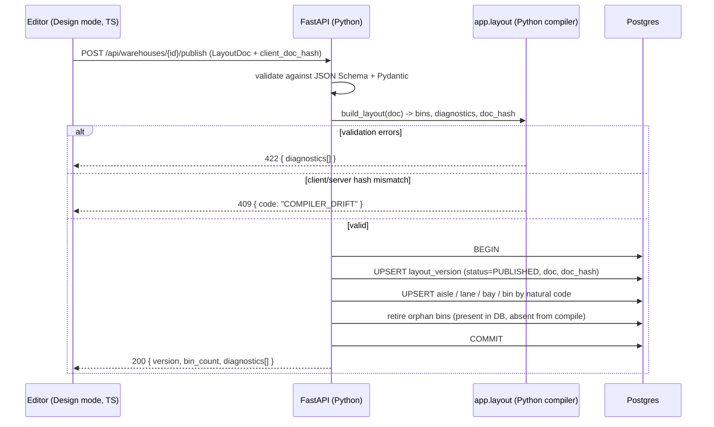

# Warehouse Designer — Design Document & Implementation Plan

**Status:** Draft v1 · awaiting sign-off
**Repo:** `warehouse-3d`
**Goal:** Turn the existing 3D warehouse *viewer* into a 3D-first warehouse **authoring tool**, whose output is a versioned, publishable layout document that a Postgres-backed API consumes and that powers the existing Operate-mode viewer.

---

## 1. Locked Decisions (from requirements Q&A)

| # | Decision | Choice |
|---|----------|--------|
| 1 | Units & axes | **Meters, right-handed, Y-up** (three.js native). 1 scene unit = 1 m |
| 2 | Footprint | **Rectangle + internal obstacles** (columns, pillars, walls, offices) |
| 3 | Terminology | **Aisle = driving/walking corridor. Lane = a rack row on one side of an aisle** |
| 4 | Bin authoring | **Per-level**: each level has its own clear height and bin depth; bay width shared per lane |
| 5 | Gaps | Horizontal (cross-aisle), vertical (level clearance), in-lane splits, skipped bays |
| 6 | Drag & drop | **SKUs with box dims + weight → bins**, validated against volume & weight capacity |
| 7 | Persistence | **Postgres + SQLAlchemy 2.0 + Alembic + FastAPI** (Python service in `server/`) |
| 8 | Language/state | **TypeScript migration** + **Zustand** (+ immer + patch-based undo/redo) |
| 9 | Editor UX | **3D-first** placement/drag in the scene, with a numeric inspector for precision |
| 10 | App shape | **One app, two modes:** `Design` and `Operate` (existing viewer becomes read-only) |
| 11 | Tenancy | Single warehouse now, but a **nullable `tenant_id` seam** on `warehouse` |
| 12 | Publish | **Instant** — no approval step. Version history provides rollback |
| 13 | Weight limits | **Per bin** and **per level** (beam load). No bay/lane/floor limits in v1 |
| 14 | Re-publish + inventory | Placements **carry forward by bin `code`**; orphans are flagged, never silently deleted |
| 15 | Web framework | **FastAPI**, synchronous endpoints |
| 16 | SQLAlchemy mode | **Sync `psycopg` 3** — one driver, Alembic needs no second driver |
| 17 | Local Postgres | **Docker Compose**, pinned PostgreSQL 16 |
| 18 | Bin code format | Confirmed `{warehouse}/{aisle}/{side}/B{bay}/L{level}` |
| 19 | Python toolchain | **Python 3.13** + **uv**; `ruff` + `mypy` + `pytest` |

### ⚠️ One correction to the brief

> *"once this design is complete, it will be used for Backend to create tables"*

Interpret this as **"the design populates tables"**, not **"the design creates tables."**

- **Tables = schema = code.** Created by **Alembic** migrations, reviewed, versioned in git, deployed.
- **Design = data.** Rows in `warehouse`, `aisle`, `lane`, `bay`, `bin`, `layout_version`.

Doing per-warehouse dynamic DDL would break: query planning, migrations, indexes, referential integrity, ORM tooling, and multi-tenant support. If a customer needs custom attributes, use a `metadata JSONB` column, not a new column/table. **This principle is non-negotiable and shapes everything below.**

---

## 2. Core Design Principles

These are the principles I recommend you adopt. Each has a concrete consequence in the codebase.

### P1 — Model-first, view-agnostic (single source of truth)
The authoritative state is a **serializable JSON layout document** held in the store. The 3D scene is a *pure projection* of it.

**Consequence:** never read geometry back out of three.js objects (`mesh.position`, `object.matrixWorld`). Editing mutates the document; rendering re-derives. Without this, "3D-first" becomes unmaintainable and unsaveable.

### P2 — Store inputs, derive outputs (deterministic compiler)
Authors set **parametric inputs** (dimensions, counts, spacings, offsets). Bins are **derived** by a pure function:

```ts
buildLayout(doc: LayoutDoc): LayoutGraph
```

Same document in → byte-identical bin list out. Never hand-edit derived bins.

**Consequence:** a 6-aisle × 25-bay × 5-level warehouse is ~1,500 bins from ~40 authored fields. Also means the client and server compile *the same* result.

### P3 — Deterministic, human-readable, path-based IDs
Bin identity is derived from structural position, not random UUIDs:

```
WH1/A03/L/B012/L2
 │    │  │   │   └── level index
 │    │  │   └────── bay index (zero-padded for sortability)
 │    │  └────────── side (L | R)
 │    └───────────── aisle number
 └────────────────── warehouse code
```

Use a **surrogate UUID PK** *plus* a **natural unique key** (`warehouseId + code`).

**Consequence:** re-publishing a layout doesn't orphan inventory. Renaming a bin is an explicit, audited operation. Sorting and label printing work lexicographically.

### P4 — Immutable versions + explicit publish
Two states: **Draft** (mutable, autosaved) and **Published** (immutable snapshot).

**Consequence:** audit trail, rollback, safe concurrent editing, and a *stable contract* for the backend and the Operate mode. Operate mode and the API read **published only**.

### P5 — Separate the four concerns
| Concern | Question it answers | Where it lives |
|---|---|---|
| **Geometry** | Where in space? | Derived from `LayoutDoc` |
| **Topology** | Which aisle/lane/bay/level? | Normalized tables |
| **Capacity** | How much fits? | Columns on `bin` / `rack_level` |
| **Inventory** | What's in it? | `placement` table |

Never mix them. "Is this bin occupied?" must not live in the same module as "where is this bin?"

### P6 — Validation is a first-class, pure, layered rule engine
Rules return **structured diagnostics**, never throw into the UI:

```ts
type Diagnostic = {
  severity: 'error' | 'warning';
  code: string;              // 'LEVEL_EXCEEDS_RACK_HEIGHT'
  message: string;
  entityRefs: EntityRef[];   // click-to-select in the UI
  data?: Record<string, unknown>;
};
```

- **Errors** block Publish (overlaps, out-of-bounds, level stack taller than rack, zero-width bay).
- **Warnings** allow Publish (aisle narrower than forklift turning radius, dead-end aisle, unreachable bin).

### P7 — Commands, not ad-hoc mutation
Every edit is a typed command applied to the store: `addAisle`, `setLevelHeight`, `moveLane`. Zustand + immer + `patch`-based history.

**Consequence:** undo/redo for free, and an event log you can later push to a server for collaborative/optimistic editing. Components never call `set()` directly.

### P8 — Unit-safety and AABB-only geometry (v1)
- One canonical unit: **meters, float64**. Display conversion at the boundary only.
- All geometry is **axis-aligned bounding boxes** → collision is cheap rectangle overlap.
- Orientations restricted to **0/90/180/270°**, stored as `rotationDeg` on the entity, *not* baked into child coordinates.
- Float comparison tolerance: `EPS = 1e-4` m (0.1 mm).

**Consequence:** an O(n log n) sweep-line overlap check replaces a full 3D SAT engine.

### P9 — One shared **contract**, two implementations, enforced by conformance vectors

Because the backend is Python (§1), a single shared code module across runtimes is impossible. Instead:

- **The contract is single-sourced.** `packages/layout-core/schema/layout-doc.v1.json` is the canonical JSON Schema. TypeScript derives Zod schemas from it; Python validates incoming documents against the same file with the `jsonschema` library and models them with Pydantic.
- **The compiler exists twice** — `buildLayout()` in TypeScript (fast, for interactive preview) and `build_layout()` in Python (authoritative, for materializing DB rows on Publish).
- **The duplication is made safe by shared conformance vectors.** `fixtures/layout-conformance/*.json` each pair a `LayoutDoc` input with expected bins, diagnostics, and `doc_hash`. **Vitest and pytest run the identical fixture set.** If the two implementations disagree, CI fails.

**Consequence:** the server can never accept a layout the client would reject, and neither implementation can silently drift. The conformance suite is a **Phase 1 deliverable, not an afterthought** — without it this architecture is unsafe.

### P10 — Schema as code, extensibility via JSONB
**Alembic** migrations define structure. Per-customer variation goes in `metadata JSONB`.

### P11 — Scale: instancing and memoization
Target: **100k+ bins**. Render via `THREE.InstancedMesh` (you already do), rebuilt only when the compiler output hash changes. Never render one React component per bin. Compile off the render path.

### P12 — Precision UX for a 3D-first editor
3D dragging is a **coarse gesture**. Precision comes from:
- grid snapping (default 0.05 m) + axis constraint (hold `Shift`)
- live dimension readout while dragging
- an **authoritative numeric inspector** — typing an exact value always wins
- optional top-down orthographic mini-map for sanity checks

### P13 — Optimistic, debounced persistence
Autosave draft (`PATCH`, debounced ~1 s) + explicit **Publish**. Concurrency via integer `version` with optimistic locking (`409` on stale write).

### P14 — No business logic in React components
Components render and dispatch commands. Geometry, validation, and capacity math live in `layout-core` / `app.layout` — never in a component.

---

## 3. Domain Model

### 3.1 Hierarchy

```
Warehouse
├── Footprint (lengthM × widthM × heightM)
├── Obstacle[]              columns, pillars, walls, offices (AABB footprints)
└── Aisle[]                 corridor: centerline, width, orientation
    ├── Lane[] (left | right | both)
    │   ├── RackLevel[]     { clearHeightM, binDepthM, beamHeightM }
    │   ├── LaneSegment[]   RACK run | GAP (doorway, cross-aisle break)
    │   └── Bay[]           { startM, widthM, isSkipped }
    │       └── Bin (derived: one per bay × level)
    └── EndGap / cross-aisle spacing to the next aisle
```

### 3.2 Terminology (canonical — use these words in code, DB, and UI)

| Term | Definition |
|---|---|
| **Warehouse** | Root aggregate. Owns the footprint. |
| **Footprint** | Outer rectangle: `lengthM` (X) × `widthM` (Z) × `heightM` (Y). |
| **Obstacle** | AABB inside the footprint that racks cannot occupy. |
| **Aisle** | A corridor. Has a centerline (`x1,z1`)→(`x2,z2`), a `widthM`, and a travel orientation. |
| **Lane** | A rack row on **one side** of an aisle. `side ∈ {LEFT, RIGHT}`. An aisle has 0, 1 or 2 lanes. |
| **RackType** | Reusable template: upright size, bay width, level stack. Referenced by lanes. |
| **RackLevel** | One shelf height band in a lane's rack: `clearHeightM`, `binDepthM`. |
| **LaneSegment** | A contiguous stretch of a lane that is `RACK` or `GAP`. Enables doorways/splits/breaks. |
| **Bay** | One column of the rack along its run. `isSkipped` marks reserved/damaged bays. |
| **Bin (Slot)** | **Derived.** The intersection of `bay × level`. Where inventory lives. |
| **SKU / ItemType** | A stockable unit: box dims, weight, stackability, rotatability, hazmat flag. |
| **Placement** | A quantity of a SKU assigned to a bin or bin-segment. |
| **LayoutVersion** | Draft or Published snapshot of the whole document. |

### 3.3 Axis & origin convention

```
        +Z  (width)
         ↑
         │
         └────→ +X (length)
       origin (0,0,0) = floor level, front-left corner
       +Y = up (floor is y = 0)
```

- Aisle `orientation ∈ {X, Z}` — the axis its centerline runs along.
- Lane offset from the aisle centerline: `aisleWidthM/2 + rackDepthM/2`, signed by `side`.
- Bin center-Y = `sum(clearHeight of levels below) + clearHeightOfThisLevel/2` (plus beam thickness).

---

## 4. Data Contract: `LayoutDoc`

The single artifact the editor edits and the API persists. Versioned, forward-compatible.

```ts
type LayoutDoc = {
  schemaVersion: 1;              // bump + migrate; never silently break
  warehouse: {
    id: string;
    code: string;                // 'WH1'
    name: string;
    lengthM: number;
    widthM: number;
    heightM: number;
    origin: { x: number; z: number };
    metadata: Record<string, unknown>;
  };
  obstacles: Obstacle[];
  rackTypes: RackType[];         // reusable templates
  aisles: Aisle[];               // each carries its lanes
};

type Aisle = {
  id: string;
  code: string;                  // 'A03'
  orientation: 'X' | 'Z';
  centerline: { x1: number; z1: number; x2: number; z2: number };
  widthM: number;                // clear corridor width
  travelDirection: 'BOTH' | 'FORWARD' | 'REVERSE';
  lanes: Lane[];
  metadata: Record<string, unknown>;
};

type Lane = {
  id: string;
  code: string;                  // 'A03-L'
  side: 'LEFT' | 'RIGHT';
  rackTypeId: string;
  startOffsetM: number;          // where the rack run begins along the aisle
  lengthM: number;
  levels: RackLevel[];           // per-level heights + bin depth
  segments: LaneSegment[];       // RACK | GAP splits
  binCodePattern: string;        // e.g. '{warehouse}/{aisle}/{side}/B{bay:03}/L{level}'
  metadata: Record<string, unknown>;
};

type RackLevel = {
  index: number;                 // 0 = ground level
  clearHeightM: number;          // usable height of the bin opening
  binDepthM: number;             // usable depth
  beamHeightM: number;           // structural beam under this level
  maxWeightKg?: number;          // per-bin load limit for this level
};

type LaneSegment = { kind: 'RACK' | 'GAP'; startM: number; endM: number; label?: string };

type Obstacle = {
  id: string;
  kind: 'COLUMN' | 'PILLAR' | 'WALL' | 'OFFICE' | 'CUSTOM';
  x: number; z: number;          // min corner
  widthM: number; depthM: number;
  heightM: number;
  metadata: Record<string, unknown>;
};
```

**Bin volume capacity** (derived, per bin):

$$
V_{\text{bin}} = w_{\text{bay}} \times h_{\text{clear}} \times d_{\text{bin}} \times \eta_{\text{util}}
$$

with $\eta_{\text{util}}$ a configurable utilization factor (default 0.85) accounting for honeycombing and handling clearance.

**Fit check** — an item box $(w_i, h_i, d_i)$ fits if **any** of the 6 axis-aligned orientations satisfies:

$$
w_i' \le w_{\text{bay}} - \varepsilon,\quad h_i' \le h_{\text{clear}} - \varepsilon,\quad d_i' \le d_{\text{bin}} - \varepsilon
$$

plus $qty \times V_i \le V_{\text{bin}}$ and $qty \times \text{weight}_i \le \max\text{WeightKg}$ (if `stackable` and orientation are respected).

---

## 5. Database Schema (Postgres + SQLAlchemy 2.0 + Alembic)

Two layers, deliberately:

1. **Document layer** — `layout_version.doc JSONB`. The authoritative, exact authored artifact. Reproducible compiler input.
2. **Materialized layer** — normalized `aisle / lane / bay / bin / placement` rows, generated **on Publish** inside one transaction. This is what queries, joins, WMS integrations and the Operate viewer hit.

> Storing both is intentional: JSONB guarantees lossless round-trip; normalized rows guarantee fast relational access. The **Python** compiler is the single bridge between them.

### 5.1 Base & naming convention — `server/app/models/base.py`

```python
import enum
import uuid
from datetime import datetime

from sqlalchemy import Enum, ForeignKey, Index, MetaData, String, UniqueConstraint, func, text
from sqlalchemy.dialects.postgresql import JSONB, UUID
from sqlalchemy.orm import DeclarativeBase, Mapped, mapped_column, relationship

# Deterministic constraint names. Without this, Alembic autogenerate emits unstable
# diffs and downgrade() breaks because it cannot address constraints by name.
NAMING_CONVENTION = {
    "ix": "ix_%(column_0_label)s",
    "uq": "uq_%(table_name)s_%(column_0_name)s",
    "ck": "ck_%(table_name)s_%(constraint_name)s",
    "fk": "fk_%(table_name)s_%(column_0_name)s_%(referred_table_name)s",
    "pk": "pk_%(table_name)s",
}


class Base(DeclarativeBase):
    metadata = MetaData(naming_convention=NAMING_CONVENTION)


class TimestampMixin:
    created_at: Mapped[datetime] = mapped_column(server_default=func.now())
    updated_at: Mapped[datetime] = mapped_column(
        server_default=func.now(), onupdate=func.now()
    )


class VersionStatus(str, enum.Enum):
    DRAFT = "DRAFT"
    PUBLISHED = "PUBLISHED"
    ARCHIVED = "ARCHIVED"
```

### 5.2 Models — `server/app/models/`

```python
class Warehouse(Base, TimestampMixin):
    __tablename__ = "warehouse"

    id: Mapped[uuid.UUID] = mapped_column(UUID(as_uuid=True), primary_key=True, default=uuid.uuid4)
    code: Mapped[str] = mapped_column(String(64), unique=True)
    name: Mapped[str] = mapped_column(String(255))
    length_m: Mapped[float]
    width_m: Mapped[float]
    height_m: Mapped[float]
    # `metadata` is reserved by DeclarativeBase -> attribute is metadata_, column stays "metadata"
    metadata_: Mapped[dict] = mapped_column(
        "metadata", JSONB, default=dict, server_default=text("'{}'::jsonb")
    )

    versions: Mapped[list["LayoutVersion"]] = relationship(
        back_populates="warehouse", cascade="all, delete-orphan"
    )


class LayoutVersion(Base, TimestampMixin):
    __tablename__ = "layout_version"

    id: Mapped[uuid.UUID] = mapped_column(UUID(as_uuid=True), primary_key=True, default=uuid.uuid4)
    warehouse_id: Mapped[uuid.UUID] = mapped_column(ForeignKey("warehouse.id", ondelete="CASCADE"))
    version: Mapped[int]
    status: Mapped[VersionStatus] = mapped_column(
        Enum(VersionStatus, name="version_status",
             values_callable=lambda e: [m.value for m in e]),
        default=VersionStatus.DRAFT,
    )
    doc: Mapped[dict] = mapped_column(JSONB)               # the LayoutDoc
    doc_hash: Mapped[str] = mapped_column(String(64))      # sha256 of canonical JSON
    diagnostics: Mapped[list] = mapped_column(
        JSONB, default=list, server_default=text("'[]'::jsonb")
    )
    created_by: Mapped[str | None] = mapped_column(String(255))
    published_at: Mapped[datetime | None]

    warehouse: Mapped["Warehouse"] = relationship(back_populates="versions")

    __table_args__ = (
        UniqueConstraint("warehouse_id", "version"),
        Index("ix_layout_version_warehouse_id_status", "warehouse_id", "status"),
        # Exactly one PUBLISHED layout per warehouse — enforced by the database, not by app code.
        Index(
            "uq_layout_version_one_published",
            "warehouse_id",
            unique=True,
            postgresql_where=text("status = 'PUBLISHED'"),
        ),
    )


class Aisle(Base, TimestampMixin):
    __tablename__ = "aisle"

    id: Mapped[uuid.UUID] = mapped_column(UUID(as_uuid=True), primary_key=True, default=uuid.uuid4)
    warehouse_id: Mapped[uuid.UUID] = mapped_column(ForeignKey("warehouse.id", ondelete="CASCADE"))
    code: Mapped[str] = mapped_column(String(32))
    orientation: Mapped[str] = mapped_column(String(1))        # 'X' | 'Z'
    x1: Mapped[float]
    z1: Mapped[float]
    x2: Mapped[float]
    z2: Mapped[float]
    width_m: Mapped[float]
    travel_direction: Mapped[str] = mapped_column(String(8), default="BOTH")
    seq: Mapped[int]
    metadata_: Mapped[dict] = mapped_column(
        "metadata", JSONB, default=dict, server_default=text("'{}'::jsonb")
    )

    lanes: Mapped[list["Lane"]] = relationship(
        back_populates="aisle", cascade="all, delete-orphan", order_by="Lane.seq"
    )

    __table_args__ = (UniqueConstraint("warehouse_id", "code"),)


class Lane(Base, TimestampMixin):
    __tablename__ = "lane"

    id: Mapped[uuid.UUID] = mapped_column(UUID(as_uuid=True), primary_key=True, default=uuid.uuid4)
    aisle_id: Mapped[uuid.UUID] = mapped_column(ForeignKey("aisle.id", ondelete="CASCADE"))
    code: Mapped[str] = mapped_column(String(32))
    side: Mapped[str] = mapped_column(String(5))               # 'LEFT' | 'RIGHT'
    rack_type_code: Mapped[str | None] = mapped_column(String(32))
    start_offset_m: Mapped[float]
    length_m: Mapped[float]
    levels: Mapped[list] = mapped_column(JSONB)                # RackLevel[]   — small, structural
    segments: Mapped[list] = mapped_column(JSONB)              # LaneSegment[] — RACK | GAP
    bin_code_pattern: Mapped[str] = mapped_column(String(128))
    seq: Mapped[int] = mapped_column(default=0)
    metadata_: Mapped[dict] = mapped_column(
        "metadata", JSONB, default=dict, server_default=text("'{}'::jsonb")
    )

    aisle: Mapped["Aisle"] = relationship(back_populates="lanes")
    bays: Mapped[list["Bay"]] = relationship(
        back_populates="lane", cascade="all, delete-orphan", order_by="Bay.seq"
    )

    __table_args__ = (UniqueConstraint("aisle_id", "code"),)


class Bay(Base):
    __tablename__ = "bay"

    id: Mapped[uuid.UUID] = mapped_column(UUID(as_uuid=True), primary_key=True, default=uuid.uuid4)
    lane_id: Mapped[uuid.UUID] = mapped_column(ForeignKey("lane.id", ondelete="CASCADE"))
    seq: Mapped[int]                     # named seq, not "index" — avoids SQL-keyword/declarative clashes
    start_m: Mapped[float]
    width_m: Mapped[float]
    is_skipped: Mapped[bool] = mapped_column(default=False)

    lane: Mapped["Lane"] = relationship(back_populates="bays")
    bins: Mapped[list["Bin"]] = relationship(back_populates="bay", cascade="all, delete-orphan")

    __table_args__ = (UniqueConstraint("lane_id", "seq"),)


class Bin(Base):
    __tablename__ = "bin"

    id: Mapped[uuid.UUID] = mapped_column(UUID(as_uuid=True), primary_key=True, default=uuid.uuid4)
    warehouse_id: Mapped[uuid.UUID] = mapped_column(ForeignKey("warehouse.id", ondelete="CASCADE"))
    bay_id: Mapped[uuid.UUID] = mapped_column(ForeignKey("bay.id", ondelete="CASCADE"))
    code: Mapped[str] = mapped_column(String(128))             # natural key: 'WH1/A03/L/B012/L2'
    level_index: Mapped[int]

    # Geometry — denormalized snapshot written at Publish
    center_x: Mapped[float]
    center_y: Mapped[float]
    center_z: Mapped[float]
    width_m: Mapped[float]
    height_m: Mapped[float]
    depth_m: Mapped[float]
    rotation_deg: Mapped[float] = mapped_column(default=0.0)

    # Capacity — kept structurally separate from geometry (P5)
    capacity_m3: Mapped[float]
    max_weight_kg: Mapped[float | None]

    metadata_: Mapped[dict] = mapped_column(
        "metadata", JSONB, default=dict, server_default=text("'{}'::jsonb")
    )

    bay: Mapped["Bay"] = relationship(back_populates="bins")
    placements: Mapped[list["Placement"]] = relationship(
        back_populates="bin", cascade="all, delete-orphan"
    )

    __table_args__ = (
        UniqueConstraint("warehouse_id", "code"),
        Index("ix_bin_warehouse_id", "warehouse_id"),
    )
```

### 5.4 Alembic configuration — `server/alembic/env.py`

```python
from alembic import context
from sqlalchemy import engine_from_config, pool

from app.config import settings
from app.models.base import Base
import app.models  # noqa: F401 — importing registers every table on Base.metadata

config = context.config
config.set_main_option("sqlalchemy.url", settings.database_url)
target_metadata = Base.metadata


def run_migrations_online() -> None:
    connectable = engine_from_config(
        config.get_section(config.config_ini_section, {}),
        prefix="sqlalchemy.",
        poolclass=pool.NullPool,
    )
    with connectable.connect() as connection:
        context.configure(
            connection=connection,
            target_metadata=target_metadata,
            compare_type=True,            # detect column type changes
            compare_server_default=True,
            include_schemas=True,
        )
        with context.begin_transaction():
            context.run_migrations()


if context.is_offline_mode():
    from alembic import context as _ctx
    _ctx.configure(target_metadata=target_metadata, literal_binds=True)
    with _ctx.begin_transaction():
        _ctx.run_migrations()
else:
    run_migrations_online()
```

`alembic.ini` essentials (URL comes from env — **never** commit credentials):

```ini
[alembic]
script_location = alembic
file_template = %%(rev)s_%%(slug)s
prepend_sys_path = .
```

Example migration, showing the two things autogenerate handles worst — native enums and partial indexes:

```python
"""initial schema

Revision ID: 0001
Revises:
"""
import sqlalchemy as sa
from alembic import op
from sqlalchemy.dialects import postgresql

revision = "0001"
down_revision = None

version_status = postgresql.ENUM("DRAFT", "PUBLISHED", "ARCHIVED", name="version_status")


def upgrade() -> None:
    version_status.create(op.get_bind(), checkfirst=True)

    op.create_table(
        "warehouse",
        sa.Column("id", postgresql.UUID(as_uuid=True), primary_key=True),
        sa.Column("code", sa.String(64), nullable=False, unique=True),
        sa.Column("name", sa.String(255), nullable=False),
        sa.Column("length_m", sa.Float(), nullable=False),
        sa.Column("width_m", sa.Float(), nullable=False),
        sa.Column("height_m", sa.Float(), nullable=False),
        sa.Column("metadata", postgresql.JSONB(),
                  server_default=sa.text("'{}'::jsonb"), nullable=False),
        sa.Column("created_at", sa.DateTime(), server_default=sa.func.now(), nullable=False),
        sa.Column("updated_at", sa.DateTime(), server_default=sa.func.now(), nullable=False),
    )

    op.create_table(
        "layout_version",
        sa.Column("id", postgresql.UUID(as_uuid=True), primary_key=True),
        sa.Column("warehouse_id", postgresql.UUID(as_uuid=True), nullable=False),
        sa.Column("version", sa.Integer(), nullable=False),
        sa.Column("status", version_status, nullable=False, server_default="DRAFT"),
        sa.Column("doc", postgresql.JSONB(), nullable=False),
        sa.Column("doc_hash", sa.String(64), nullable=False),
        sa.Column("diagnostics", postgresql.JSONB(),
                  server_default=sa.text("'[]'::jsonb"), nullable=False),
        sa.Column("created_by", sa.String(255)),
        sa.Column("published_at", sa.DateTime()),
        sa.Column("created_at", sa.DateTime(), server_default=sa.func.now(), nullable=False),
        sa.Column("updated_at", sa.DateTime(), server_default=sa.func.now(), nullable=False),
        sa.ForeignKeyConstraint(["warehouse_id"], ["warehouse.id"], ondelete="CASCADE"),
        sa.UniqueConstraint("warehouse_id", "version"),
    )

    # Exactly one PUBLISHED layout per warehouse.
    op.create_index(
        "uq_layout_version_one_published",
        "layout_version",
        ["warehouse_id"],
        unique=True,
        postgresql_where=sa.text("status = 'PUBLISHED'"),
    )


def downgrade() -> None:
    op.drop_index("uq_layout_version_one_published", table_name="layout_version")
    op.drop_table("layout_version")
    op.drop_table("warehouse")
    version_status.drop(op.get_bind(), checkfirst=True)
```

### 5.5 Alembic gotchas — every autogenerated migration must be hand-reviewed

| Gotcha | Why it bites | Handle it by |
|---|---|---|
| `sa.Enum` type creation | Autogenerate can emit a `CREATE TYPE` that already exists, or omit it on downgrade | Declare the enum explicitly (`postgresql.ENUM(...)`) with `create_type=False` on the column, and `.create()` / `.drop()` in `upgrade`/`downgrade` |
| Adding a value to an existing enum | `ALTER TYPE ... ADD VALUE` cannot run inside a transaction block in older PG | Separate migration with `op.execute` on a non-transactional connection |
| Partial / expression indexes | Autogenerate does not detect `postgresql_where` | Hand-write, as in the example above |
| JSONB `server_default` | Autogenerate diffs `'{}'::jsonb` inconsistently | `compare_server_default=True` + explicit `sa.text(...)` |
| Constraint renames | Without `NAMING_CONVENTION`, names are database-generated and unstable | Always set `MetaData(naming_convention=...)` (§5.1) |
| `downgrade()` not implemented | Blocks rollback and staging resets | **Every migration must have a real, tested `downgrade()`**; CI runs `upgrade head` then `downgrade base` then `upgrade head` |

Also note:
- **Float vs Numeric.** Dimensions use `double precision` (`sa.Float`). If you later want exact decimal arithmetic for invoicing-grade dimensions, switch to `Numeric(10, 4)` (¼ mm) — the compiler's `units.py` is the only place to change it.
- **`metadata` is reserved** on `DeclarativeBase`, hence the `metadata_` attribute mapped to a `"metadata"` column.
- **`index` is avoided** as a column name; bay/lane ordering uses `seq`.
- **`Bin` geometry is a denormalized snapshot.** Source of truth remains `LayoutDoc`; it can always be recomputed.
- **`Placement` is inventory**, never authored by the designer's geometry tools.

### Publish sequence



Idempotent by `doc_hash`: re-publishing an unchanged doc is a no-op.

The client sends its own TS-computed `client_doc_hash`. If it disagrees with the server's Python-computed hash, the publish is **rejected with `COMPILER_DRIFT`** rather than silently accepted. This is the mechanism that makes P9's dual implementation safe — it turns a silent correctness bug into a loud failure.

---

## 6. The layout core — `layout-core` (TS) + `app/layout` (Python)

Two implementations of the same specification, kept honest by shared conformance vectors (P9).

```
packages/layout-core/
├── schema/
│   └── layout-doc.v1.json         # ← CANONICAL CONTRACT (single source of truth)
└── src/
    ├── types.ts                   # generated from the JSON Schema
    ├── schema.ts                  # Zod schemas generated from the JSON Schema
    ├── units.ts                   # EPS, mm/m helpers, rounding, snap
    ├── geometry.ts                # AABB overlap, orientationToVec, projectToGround
    ├── ids.ts                     # deterministic bin code generation
    ├── compile.ts                 # buildLayout(doc) -> LayoutGraph   ← PURE
    ├── capacity.ts                # binVolume(), itemFits(), bestOrientation()
    ├── canonical.ts               # canonical JSON -> sha256 (must match Python byte-for-byte)
    ├── validate/                  # bounds, structure, access, capacity
    └── migrate.ts                 # schemaVersion migrations

server/app/layout/                 # Python mirror — authoritative for DB writes
├── compile.py                     # build_layout(doc) -> bins, diagnostics, doc_hash
├── geometry.py
├── capacity.py
├── canonical.py
└── validate/

fixtures/layout-conformance/       # ← run by BOTH vitest and pytest
├── 001_single_aisle_left.json     # { doc, expectedBins, expectedDiagnostics, expectedDocHash }
├── 002_both_sides_multi_level.json
├── 003_lane_gap_split.json
├── 004_obstacle_overlap_error.json
└── ...
```

### The canonical hash is the load-bearing detail

`doc_hash` must be **byte-identical** across TypeScript and Python or Publish will reject itself. Specify it precisely, in both languages:

1. Recursively sort object keys (ASCII/UTF-8 ordinal order).
2. Numbers: round to 6 decimal places, fixed notation, no exponent, no trailing zeros, `-0` normalised to `0`.
3. Strings as UTF-8; no unicode escaping; `NaN`/`Infinity` forbidden by schema.
4. Arrays keep their order (order is semantic here).
5. `sha256` over the UTF-8 bytes, lowercase hex.

This is exactly the kind of thing that silently differs between runtimes, so it gets its own fixture set and its own test on both sides.

Everything in both cores is pure, framework-free, and unit-testable without a browser, a database, or a running server.

---

## 7. Application Architecture

### 7.1 Repo layout (minimal churn from today's app)

```
warehouse-3d/
├── package.json                # ← gains "workspaces": ["packages/*", "server"]
├── src/                        # React app (root stays the web app)
│   ├── app/
│   │   ├── App.tsx             # mode switcher: Design | Operate
│   │   └── router.tsx
│   ├── design/                 # ← NEW: the authoring tool
│   │   ├── DesignWorkspace.tsx
│   │   ├── scene/
│   │   │   ├── DesignCanvas.tsx        # Canvas + controls + snapping grid
│   │   │   ├── AisleGizmo.tsx          # drag/rotate aisle in 3D
│   │   │   ├── LaneGhost.tsx           # live preview of the lane being placed
│   │   │   ├── ObstacleGizmo.tsx
│   │   │   ├── BinsInstanced.tsx       # InstancedMesh from derived bins
│   │   │   └── DropTarget.tsx          # raycast drop zone for SKU drag & drop
│   │   ├── panels/
│   │   │   ├── FootprintPanel.tsx      # length/width/height, obstacles list
│   │   │   ├── AislePanel.tsx          # add/edit/delete aisles
│   │   │   ├── LanePanel.tsx           # side (L/R/both), run length, segments
│   │   │   ├── LevelEditor.tsx         # per-level clear height + bin depth
│   │   │   ├── InspectorPanel.tsx      # numeric authority for selection
│   │   │   ├── DiagnosticPanel.tsx     # errors/warnings, click-to-focus
│   │   │   └── SkuPalette.tsx          # draggable SKUs
│   │   ├── store/
│   │   │   ├── designStore.ts          # Zustand + immer + patches
│   │   │   ├── commands.ts             # typed command creators
│   │   │   └── history.ts              # undo/redo middleware
│   │   └── persistence/
│   │       ├── apiClient.ts
│   │       └── autosave.ts             # debounced draft PATCH
│   ├── operate/                        # existing viewer, refactored
│   │   ├── OperateWorkspace.tsx
│   │   └── ...                         # WarehouseCanvas, ControlPanel, etc.
│   └── shared/                         # design + operate common bits
├── packages/layout-core/               # ← pure TS core; mirrors server/app/layout (P9)
├── fixtures/layout-conformance/        # ← cross-language fixtures, run by BOTH runtimes
├── server/                             # ← NEW: Python API (FastAPI + SQLAlchemy + Alembic)
│   ├── pyproject.toml                  # uv / poetry; ruff + mypy + pytest
│   ├── alembic.ini
│   ├── alembic/
│   │   ├── env.py
│   │   ├── script.py.mako
│   │   └── versions/0001_initial.py
│   ├── app/
│   │   ├── main.py                     # FastAPI app
│   │   ├── config.py                   # pydantic-settings (DATABASE_URL from env)
│   │   ├── db.py                       # engine, session factory
│   │   ├── models/                     # SQLAlchemy 2.0 declarative
│   │   │   ├── base.py
│   │   │   ├── warehouse.py
│   │   │   ├── structure.py            # Aisle, Lane, Bay, Bin
│   │   │   ├── sku.py
│   │   │   └── placement.py
│   │   ├── schemas/                    # Pydantic v2 DTOs for the wire contract
│   │   ├── layout/                     # Python compiler + validators (mirrors layout-core)
│   │   ├── services/publish.py         # transactional materializer
│   │   └── api/routes/
│   └── tests/
│       ├── conformance/                # runs ../../fixtures/layout-conformance
│       └── migrations/                 # upgrade head -> downgrade base -> upgrade head
├── fixtures/layout-conformance/        # cross-language fixtures, run by BOTH runtimes
└── docs/warehouse-designer-plan.md     # this file
```

### 7.2 State model

```ts
type DesignState = {
  doc: LayoutDoc;                  // authoritative, serializable
  selection: EntityRef[];
  tool: ToolMode;                  // SELECT | ADD_AISLE | ADD_OBSTACLE | PLACE_SKU
  snapM: number;                   // default 0.05
  derived: {                       // recomputed by selector, never hand-edited
    bins: DerivedBin[];
    diagnostics: Diagnostic[];
    hash: string;
  };
  ui: { mode: 'DESIGN' | 'OPERATE'; panel: PanelId; hoveredBinId?: string };
  history: { past: Patch[][]; future: Patch[][] };
};
```

Derived data recomputes via a **memoized selector** keyed on `hash`. Editing a level height recompiles once, not once per frame.

### 7.3 Command example

```ts
export const setLevelHeight = (laneId: string, levelIndex: number, clearHeightM: number) =>
  (draft: LayoutDoc) => {                       // immer recipe
    const lane = findLane(draft, laneId);
    if (!lane) return;
    const lvl = lane.levels[levelIndex];
    if (!lvl) return;
    lvl.clearHeightM = clamp(clearHeightM, 0.05, draft.warehouse.heightM);
  };
```

Undo/redo wraps the recipe in an immer `produceWithPatches` call and stores `patches` / `inversePatches`.

### 7.4 API surface (v1)

| Method | Path | Purpose |
|---|---|---|
| `GET` | `/api/warehouses` | list |
| `POST` | `/api/warehouses` | create (footprint) |
| `GET` | `/api/warehouses/:id` | detail + active version |
| `PUT` | `/api/warehouses/:id/draft` | autosave draft `LayoutDoc` (debounced; `If-Match: version`) |
| `POST` | `/api/warehouses/:id/validate` | run validators, return diagnostics (no write) |
| `POST` | `/api/warehouses/:id/publish` | validate → materialize → publish (transaction) |
| `GET` | `/api/warehouses/:id/versions` | version history |
| `GET` | `/api/warehouses/:id/layout` | **published** `LayoutGraph` for Operate mode |
| `GET/POST/PUT` | `/api/warehouses/:id/skus` | SKU templates |
| `POST` | `/api/bins/:binId/placements` | assign SKU (validated: fit + capacity) |
| `DELETE` | `/api/placements/:id` | unassign |

Validation and placement rules are implemented in **both** cores and pinned by conformance vectors (P9). The TS client generates `src/design/persistence/apiClient.ts` from the FastAPI OpenAPI schema (`openapi-typescript`), so the API surface is never hand-duplicated either.

---

## 8. 3D-First Editor UX

Since you chose 3D-first, here's how I keep it precise (P12):

| Interaction | Behavior |
|---|---|
| **Add aisle** | Pick tool → click floor → drag along X or Z → release. Grid-snapped to `snapM`. |
| **Add lane** | Select aisle → click `+ Left` / `+ Right` / `+ Both`. Ghost preview shows depth + run length. |
| **Resize / move** | Drag gizmo handle (`Shift` = axis lock); live dimension HUD (e.g. `24.60 m × 3.20 m`). |
| **Exact values** | Inspector panel inputs always the authority; typing overrides drag. |
| **Levels** | Table in `LevelEditor`: per-level clear height + bin depth, running total vs rack height with inline over-limit error. |
| **Gaps** | Split a lane run → drag the gap boundary; skipped bays toggleable in a bay strip view. |
| **Obstacles** | Place column/pillar/wall/office; shown as translucent volumes until publish. |
| **SKU drag & drop** | Drag from palette → raycast onto `InstancedMesh` → drop target = `instanceId` → live green/red ghost from `itemFits()`. |
| **Bulk assignment** | For >20 bins, a 2D grid/table view with multi-select + "fill N bins" — dragging thousands of items in 3D is not viable. |
| **Diagnostics** | Click an error → camera flies to and selects the offending entity. |

**Non-negotiable:** every drag must be reversible, snapped, and reflected numerically in the inspector at all times. If the inspector and the 3D view ever disagree, the inspector wins.

---

## 9. Implementation Plan — Step by Step

Sequenced so each phase is independently verifiable and nothing is built on unverified foundations.

### Phase 0 — Foundations
- **Two toolchains:** Node/npm workspaces for `packages/*`, and Python in `server/` managed with `uv` + `ruff` + `mypy` + `pytest`.
- TypeScript migration: `allowJs` + `checkJs` off initially, rename `src/**` incrementally, `strict: true` for **new** files from day one.
- **Freeze the canonical contract first:** author `packages/layout-core/schema/layout-doc.v1.json`, then generate TS types + Zod schemas from it.
- Local Postgres via Docker Compose; `alembic.ini` + `env.py` wired up and `0001_initial` written.
- One shared error envelope across both runtimes: `{ code, message, diagnostics[] }` — API errors and validator diagnostics use the same shape.
- ADRs: `docs/adr/0001-schema-as-code.md`, `docs/adr/0002-python-backend-and-conformance-vectors.md` (records the P9 tradeoff explicitly).
- **DoD:** `npm run build` passes; `alembic upgrade head` → `downgrade base` → `upgrade head` all succeed against a fresh database; one trivial conformance fixture passes in **both** Vitest and pytest.

### Phase 1 — Domain model + compiler, in both languages (no UI)
- JSON Schema → TS types + Zod schemas; Pydantic models + `jsonschema` validation on the Python side.
- `compile.ts` **and** `compile.py` implementing the identical specification, plus `canonical.ts` / `canonical.py`.
- **`fixtures/layout-conformance/` is a deliverable of this phase, not a later chore.** Golden files: doc in → exact bins, diagnostics, and `doc_hash` out. Run by Vitest *and* pytest.
- Property tests in TS (`fast-check`) and Python (`hypothesis`): no two derived bins overlap; bin count is always `Σ(bays × levels)`.
- **DoD:** the 6×25×5 doc compiles to 1,500 bins in <10 ms in **both** languages, and every conformance fixture agrees byte-for-byte — **including `doc_hash`**. Do not start Phase 2 until this is green.

### Phase 2 — Validators (both languages)
- Bounds/obstacle overlap (sweep-line), structural limits, access warnings, capacity.
- Each rule has a fixture that triggers it and one that does not.
- Implemented once per language; both must return **identical** diagnostics arrays for every fixture.
- **DoD:** `runValidators()` / `run_validators()` return structured diagnostics with `entityRefs` for every code, and conformance fixtures prove the two agree.

### Phase 3 — Store, commands, history
- Zustand + immer + patch history; typed command creators for every mutation.
- **DoD:** add aisle → undo → redo leaves `docHash` identical to the original.

### Phase 4 — 3D design canvas
- Grid + snapping, AABB meshes, selection + hover, transform gizmos, orthographic mini-map.
- Instanced bins driven by the derived selector.
- **DoD:** author a 3-aisle layout end-to-end in 3D; inspector reflects every value exactly.

### Phase 5 — Authoring panels
- Footprint, obstacles, aisle list, lane config, `LevelEditor` with running height total, gap/segment editing, skip bays.
- **DoD:** per-level heights + a mid-lane gap produce the expected bins; over-height shows inline error.

### Phase 6 — Diagnostics + publish workflow
- `DiagnosticPanel` with camera fly-to; publish modal blocking on errors, listing warnings.
- **DoD:** an out-of-bounds lane cannot be published; fixing it enables Publish.

### Phase 7 — Python backend (FastAPI + SQLAlchemy + Alembic)
- SQLAlchemy models (§5.2) and the Alembic `0001_initial` migration, reviewed against the gotcha table in §5.5.
- FastAPI routes (§7.4); `services/publish.py`: transactional, idempotent on `doc_hash`, rejects `COMPILER_DRIFT`; draft autosave with `If-Match`.
- `openapi-typescript` generates `apiClient.ts` from the FastAPI schema; Pydantic DTOs own the wire contract.
- **DoD:** publish → `bin` rows match the TS-compiled bins 1:1; re-publishing an unchanged doc is a no-op; the upgrade/downgrade/upgrade cycle is green in CI.

### Phase 8 — SKU drag & drop + inventory
- SKU CRUD + palette; raycast drop targets; `itemFits()` ghost; `POST /placements` revalidates server-side; utilization heatmap.
- Bulk grid assignment.
- **DoD:** dropping an oversized SKU is rejected client-side *and* server-side with the same diagnostic code.

### Phase 9 — Operate mode integration
- Retire `mockData.js` and the hardcoded `CONFIG` in `WarehouseCanvas.jsx`; both become projections of the published layout.
- Mode switcher in `App.tsx`.
- **DoD:** a layout designed in Design mode renders identically in Operate mode; picking route still works.

### Phase 10 — Hardening
- Perf pass at 100k bins (frame time, instance buffer rebuilds, culling).
- Seed scripts, Playwright e2e, API tests, README + operator manual.

---

## 10. Risks & Mitigations

| Risk | Impact | Mitigation |
|---|---|---|
| 3D-first drag is imprecise for real engineering dims | Wrong layouts in production | Numeric inspector is authoritative; snapping; optional top-down view (P12) |
| **TS and Python compilers drift on a layout no fixture covers** | **Silently wrong bins in the database** | Shared conformance vectors (P9) + `client_doc_hash` mismatch → hard `409 COMPILER_DRIFT`. Highest-severity risk in this design |
| **Canonical JSON hash differs between runtimes** | Publish rejects itself, or false drift alarms | Explicit canonicalisation spec (§6) with its own fixtures on both sides |
| **Alembic autogenerate emits a wrong migration** | Broken schema, failed rollback | `NAMING_CONVENTION`, `compare_type`/`compare_server_default`, hand-review every migration, CI upgrade/downgrade/upgrade test |
| Derived-vs-stored bin divergence | Inventory orphans | Pure compiler; publish idempotent on `doc_hash`; published version is the only read path |
| TS migration ahead of pure-JS JSX | Slower early velocity | `allowJs`, migrate on touch, `strict` for new files only |
| 100k bins in React | Unusable UI | InstancedMesh + memoized selector keyed on hash (P11) |
| Scope creep into WMS | Never ships | Explicit non-goals below |
| Float drift in geometry | Phantom overlaps | `EPS` comparisons; canonical rounding at compile boundary |

---

## 11. Non-Goals (v1)

- Multi-tenant orgs, SSO, RBAC (add a `tenantId` seam now, implement later).
- Dynamic DDL per warehouse (rejected by design — see §1).
- CAD/DXF import, arbitrary polygons, sloped floors, mezzanines.
- Full 3D collision physics, non-axis-aligned rotation.
- Automated slotting/picking-route optimization (later; the geometry will support it).
- Real-time multi-user co-editing (command log leaves the door open).

---

## 12. Decisions (locked 2026-09-22) & Deferred Questions

### Locked — see §1 rows 11–19

| Question | Decision |
|---|---|
| Multi-tenant in v1? | No. Add a nullable `tenant_id` column on `warehouse` now so tenancy is a backfill, not a rewrite. Do **not** thread it through every table — it is derivable via `warehouse_id`. |
| Publish approval? | Instant publish. `layout_version` history gives rollback; an approval flow can wrap the same endpoint later. |
| Weight limits? | Per bin (`bin.max_weight_kg`) and per level (`RackLevel.maxWeightKg`, the beam UDL). Bay/column, lane/run and floor loads are **out of scope for v1** but the level sum gives a usable proxy. |
| Placements on re-publish? | Carry forward, matched by bin `code`. Bins present in the new compile keep their placements. Orphaned placements are **flagged and reported**, never auto-deleted — publish returns them in the response. |
| Framework / driver / DB? | FastAPI + sync `psycopg` 3 + Docker Compose Postgres 16. |
| Bin code format? | Confirmed as `{warehouse}/{aisle}/{side}/B{bay}/L{level}`. |
| Fixture location? | Repo root, `fixtures/layout-conformance/` — visible to both toolchains and language-neutral. |

### Still open (non-blocking — none of these affect Phase 0/1)

1. **Aisle travel direction** — is `FORWARD`/`REVERSE` needed for routing, or is `BOTH` always fine? (`travelDirection` is stored but unused by the compiler.)
2. **Skipped bays** — are these "reserved", "damaged", or "temporarily blocked"? Distinct semantics may warrant distinct states rather than one `is_skipped` flag.
3. **Rack rotation** — is 0/90° sufficient, or must whole aisles rotate at arbitrary angles? (v1 is axis-aligned only.)
4. **Dimension source** — manual entry only in v1, or floor-plan import later?
5. **Deployment target** for `server/` — Docker, Railway, Fly.io, on-prem? Serverless is a poor fit for long-lived SQLAlchemy pools plus Alembic.
6. **Orphan placement policy** — once flagged, should an operator be able to bulk re-map them to new bins in one action?

---

## 13. Build Status

### Phase 0 — Foundations · COMPLETE

| Deliverable | Evidence |
|---|---|
| Both toolchains | npm workspaces (`packages/*`) + `uv` in `server/`; Python 3.13, Node 20 |
| Canonical contract frozen | `packages/layout-core/schema/layout-doc.v1.json`, generated from the Zod source via `npm run gen:schema` |
| Alembic wired | `alembic.ini` + `env.py` (URL from env, never committed) + `0001_initial` |
| Migration reversible | `upgrade head` → `downgrade base` → `upgrade head` passes; **and `alembic check` reports no drift**, so the models and the migration are provably in sync |
| Shared error shape | `diagnostics` are structured `{severity, code, message, entityRefs, data}` on both sides |
| ADRs | `docs/adr/` — recorded in §1 rows 11–19 |

### Phase 1 — Domain model + compiler · COMPLETE

- `compile.ts` **and** `compile.py` implement the identical specification, including `canonical.ts` / `canonical.py`.
- **`fixtures/layout-conformance/` is live** — 6 fixtures, run by both `vitest` and `pytest`.
- **The load-bearing result: all 6 fixtures produce byte-identical `docHash` in TypeScript and Python.** Publish cannot self-reject.
- 93 TypeScript tests + 76 Python tests green.

### Bugs the tests caught (why the fixture suite earns its keep)

| Bug | Consequence if unshipped |
|---|---|
| `Number.prototype.toFixed(6)` returns `"1e+21"` at 1e21 | Exponent notation in the hash stream — every large-magnitude document would hash differently across runtimes |
| Enum type created twice (explicit `.create()` **and** as a side effect of `op.create_table`) | Every fresh `alembic upgrade` failed with `DuplicateObject` |
| Model `default=` vs migration `server_default=` | `alembic check` permanently noisy, so real drift would be ignored |
| English-vs-metric mix-up in three capacity test expectations | Silently wrong `itemFits` assumptions about what blocks a placement |
| `BIN_CODE_DUPLICATE` fired only at `count === 2` and never accumulated | The rule reported *that* a code collided but not how badly, and made `DIAGNOSTICS_TRUNCATED` unreachable — found by the new coverage gate, not by a human |

### Phase 2 — Validators · COMPLETE

| Deliverable | Evidence |
|---|---|
| Rule registry as the single source of truth | `packages/layout-core/src/rules.ts` — 24 rules, each with one severity and a description. `RuleCode` is a derived union, so a typo at a call site is a **compile error**, not a dead rule. |
| Severity centralised | `DiagnosticCollector.report()` takes severity from the registry. `error()` / `warn()` are readability aids that **throw** if the registry disagrees, so a rule cannot be reclassified silently. |
| Registry shared across languages | `schema/rule-codes.json` is generated from the TypeScript registry; `app/layout/rules.py` loads it and raises `UnknownRuleError` for anything absent. |
| Full-diagnostic comparison | Fixtures now pin the **entire** diagnostic list — order, severity, `entityRefs` and computed `data` — not just a set of codes. Previously a divergence in `entityRefs` or in a computed float would have passed unnoticed. |
| One fixture per rule | 19 layout fixtures (from 6) plus 11 placement cases. 24/24 rules covered. |
| Coverage is enforced, not aspirational | `npm run gen:hashes` **exits non-zero** if any registered rule has no coverage. Both test suites also assert it independently. |
| Placement rules unified with layout rules | `QTY_NOT_POSITIVE`, `ITEM_DOES_NOT_FIT_OPENING`, `EXCEEDS_BIN_VOLUME`, `EXCEEDS_BIN_WEIGHT` are registry entries, so a rejected drag-and-drop returns the same diagnostic shape as a bad layout. `validatePlacement()` turns a `FitResult` into diagnostics with `bin` + `sku` refs. |

**136 TypeScript tests + 173 Python tests green.**

Notable fixtures: `014_lane_overlap` (aisles placed 1 m apart — invisible to any per-aisle check), `019_diagnostics_truncated` (36 bays breaching the wall, proving the 25-per-code cap and the truncation summary), `015_bin_code_duplicate` (one report naming the code and its total count, not one per colliding bin).

### Phase 3 — Store, commands, history · COMPLETE

| Deliverable | Evidence |
|---|---|
| Typed commands are the only mutation path | `packages/layout-core/src/commands.ts` — 20 command types in a discriminated union, with a `RecipeMap` mapped type so a missing recipe is a **compile error**. `COMMAND_LABELS` gives every command an undo label. |
| Commands are total, not restrictive | A recipe refuses only when the command is *impossible* (missing target, schema violation). Creating a geometrically wrong layout is allowed — the validators report it, and the user fixes it in place. That keeps P6's "validate, don't prevent" honest. |
| New entities built through the schemas | `makeLane` / `makeAisle` / `makeRackType` call `Schema.parse(...)`, so **the schema applies its own defaults**. No second list of default values to keep in sync. |
| Deterministic ids for tests | `createSequentialIdFactory()`, injected via `CommandContext`. Undo/redo restores the *same* id, which is what makes the round-trip test meaningful. |
| Patch-based undo/redo as a value | `history.ts` — `HistoryState` is plain data and every operation returns a new state. `commit` / `undo` / `redo` / `canUndo` / `undoLabel`, bounded by `HISTORY_LIMIT` (200). |
| Editor store, framework-free | `store.ts` on `zustand/vanilla` — no React dependency, so the editor state machine is covered by the same suite as the compiler. `doc` and the derived `graph` are set in the **same** `set()` call, so they cannot disagree. |
| Memoized compile | `compileCached` keys on document object identity; immer's structural sharing means identity changes exactly when a recompile is needed. |
| **DoD met** | `add aisle → undo → redo` restores the identical `docHash` **and** deep-equals the original. The same is proven for a 10-command sequence, rewound fully and replayed fully. |

**233 TypeScript tests + 173 Python tests green.**

#### Design decisions worth recording

- **The document is always normalized.** A lane's `segments` used to be optional, so a stored document could omit it while the compiler treated it as present — one document, two readings, and the editor would have had to know that `undefined` means "one RACK run". `defaultLaneSegments()` is now single-sourced in `schema.ts` and materialized at *every* entry point (`normalizeDoc`, `makeLane`, `document.replace`). Commands also clamp segments when a lane is shortened, so "segments lie inside the lane" holds by construction.
- **The store lives in `layout-core`, not `src/design/store/` as §7.2 proposed.** `zustand/vanilla` has no React dependency, so this keeps the editor state machine testable in the existing suite with no second harness. Deviation is deliberate; the React binding arrives in Phase 4.

### Phase 4 — 3D design canvas · COMPLETE

| Deliverable | Evidence |
|---|---|
| React binding over the Phase 3 store | `src/design/store/designStore.ts` — a module singleton `designStore = createDesignStore(createInitialDoc())` plus `useDesignStore(selector)`. The store itself still lives in `layout-core`; this file is only the React seam. |
| A layout worth looking at, from data alone | `src/design/initialDoc.ts` builds the starting document purely through `layout-core` helpers: 40 × 20 × 8 m envelope, one rack type, three aisles, **72 bays / 360 bins / 0 diagnostics / Publishable**. Nothing in the scene is hand-placed — everything is derived by the compiler. |
| Floor, grid and footprint | `scene/WarehouseFloor.tsx` — slab, drei `Grid` (1 m cells, 5 m sections) and a `FootprintOutline` drawn from a `BufferGeometry` `lineLoop`. |
| 100k-bin-ready rendering | `scene/BinsInstanced.tsx` — **one** `InstancedMesh` for every bin, with a per-instance colour ramp over usable volume. A hover tooltip is the only DOM the bins ever create. |
| Ground-projected interaction | `scene/useGroundProjector.ts` returns `(clientX, clientY) → {x, z} | null` by raycasting against the y = 0 plane, so click-to-place and drag-to-move share one coordinate path. |
| Drag an aisle, one edit, snapped | `scene/AisleGizmos.tsx` — corridor slab is draggable, rack runs are split into contiguous groups so segment gaps stay visible, and the whole gesture commits exactly **one** `aisle.translate`. |
| Numeric truth, not just pictures | `panels/InspectorPanel.tsx` — the inspector is authoritative: warehouse envelope, aisle coordinates, a level table with stack-height readout, lane and bin sections. Every field commits through a command. |
| Diagnostics in the UI | `panels/DiagnosticList.tsx` — severity-sorted, clicking one selects the most specific `entityRef`. |
| Toolbar | `panels/Toolbar.tsx` — undo/redo, Select / + Aisle / + Column, snap selection, live counts and a publishable badge. |

**Verified in the browser.** Dragging a corridor moves the aisle (`centerline.z1` 17 → 24.65), commits exactly one "Move aisle" edit, leaves the *aisle* selected, and undo restores `z1 = 17` with no phantom edits. A plain bin click selects that bin and shows its derived data; right-drag orbit leaves the selection untouched.

| Bug | Cause | Fix |
|---|---|---|
| Drag stuck on; every later pointer move committed a phantom `aisle.translate` (observed: 10 edits, 29 errors, "Blocked") plus a React "cannot update while rendering" error | Listeners were attached in a `useEffect` keyed on a `dragging` flag. When `pointerup` landed before that effect ran, the drag was never torn down and each subsequent render added **another** pair of listeners. | Attach and remove `pointermove` / `pointerup` / `pointercancel` **synchronously inside the `pointerdown` handler**, held in an `ActiveDrag` ref, with an `if (dragRef.current) return` re-entry guard. `pointercancel` is treated as an abort; unmount still cleans up. |
| Canvas silently rendered nothing | Both side panels (373 px + 331 px) exceeded the available width, collapsing `.canvas-area` to 0 px. R3F does not warn about a zero-sized canvas. | Responsive CSS: `.canvas-area { min-width: 320px }`, right panel hidden below 1180 px, left panel below 820 px. |
| Corridor slab almost impossible to grab | The rack volumes sit in front of the slab, so the corridor was occluded at every useful angle. | A floating drag handle (cylinder + pole) above the rack stack, and `raycast={() => null}` on the rack run volumes. |
| Selection lost / hijacked after a drag | R3F dispatches `click` after `pointerup` and raycasts independently, so the click landed on whatever was under the cursor — a bin, later the floor — overwriting the selection the drag had just made. | `scene/useClickNotDrag.ts`: record where the pointer went down, and treat a click as ours **only** if this object saw that pointerdown *and* the pointer moved ≤ 4 px. Used by both the bins and the ground plane. |

#### Design decisions worth recording

- **A click is only "mine" if I saw the pointerdown.** The alternative — treating an unrecorded pointerdown as a valid click — is exactly what let the floor clear the aisle selection after a drag. Failing closed here costs nothing (a genuine click always has a pointerdown on the same object) and removes a whole class of gesture-cross-talk bugs.
- **`__designStore` is exposed on `globalThis` only under `import.meta.env?.DEV`.** It makes the editor scriptable for verification and debugging without shipping a test hook to production.
- **The scene holds no layout state.** Provisional drag positions live in component state for the duration of one gesture; the moment the pointer is released they are discarded and the document is the only source of truth. Snap is applied to the *resulting* position, not accumulated per move.
- **Numbers are edited through `key`-remounted inputs.** `InlineNumber` uses `key={String(value)}` with `defaultValue`, so a field commits on blur or Enter but still refreshes when the value changes underneath it — for example when undo runs. `NumberField` keeps a local draft, so typing does not create one history entry per keystroke.

### Phase 5 — Authoring panels · COMPLETE

| Deliverable | Evidence |
|---|---|
| A lane can finally be reached | `panels/StructurePanel.tsx` — the navigable outline (warehouse → aisles → lanes, plus obstacles). **This was the phase's real blocker:** lanes have no mesh of their own, so before this the lane editor existed but nothing could select a lane, and every lane setting was authorable in the schema and unreachable in the editor. |
| Create without leaving the tree | `panels/laneActions.ts` — `useAddLane` clones a sibling lane's levels so a new lane starts with the aisle's stack; `useAddObstacle` places a column at the footprint centre. Both select what they created. Codes and ids are *omitted* from the command so the numbering rule stays in `makeLane`/`nextLaneCode`. |
| Run (RACK / GAP) editing | `panels/SegmentsEditor.tsx` — per-run kind, start, end and label, plus **"+ Gap in the middle"**, which splits the longest rack run and drops a bay-wide gap on its centre. Doing that arithmetic by hand is how you get a gap that lands off a bay centre (and removes nothing) or overlaps its neighbour (and is refused). |
| Reserved bays | `panels/SkipBaysEditor.tsx` — a bay grid per lane. Gaps are drawn disabled and dashed so the grid still reads as a plan, and "return all N to service" clears them in one edit. |
| `LevelEditor` with running height | `panels/InspectorPanel.tsx` — a **Top** column per level, accumulated exactly as the compiler accumulates (beam, then clear), so the column cannot disagree with the bins it produces. Each level row's top turns red past the building height, alongside the existing over-height warning. |
| Orthographic mini-map | `panels/MiniMap.tsx` — SVG plan view, drawn from the derived bays. Chosen over a second `<Canvas>` because perspective is a poor instrument for checking alignment, and SVG costs no second WebGL context, no extra render loop, and stays crisp. Clicking selects aisles, lanes and obstacles. |
| Footprint | `WarehouseSection` gains origin X/Z. |
| Refusals are visible | `panels/OutcomeNotice.tsx` — `lane.setSegments` refuses overlapping runs and `lane.removeLevel` refuses to empty a lane, so a refused command needs somewhere to say why. The notice clears itself: every dispatch replaces `lastOutcome`. |

**Fixed in the core:** `warehouse.update` did not accept `origin`, so the footprint origin was in the schema but uneditable. `lane.setSegments` also accepted an empty array, which broke the "the document is always normalized" invariant — `segments: []` in memory becomes one full-length RACK run after any save/reload, changing the layout *and* its `docHash`. Both now refuse/handle it at the source.

#### Design decisions worth recording

- **Pre-flight validation mirrors the command's invariants, and says so.** `SegmentsEditor` checks a proposed edit before dispatching, because a refused command leaves the document untouched while an uncontrolled input would keep showing the rejected value. The command remains the authority and re-validates; the check exists only to keep the editor and the document in step, and a rejected edit bumps a revision counter to remount the row and restore the document's values.
- **The bay count comes from the compiler, not from arithmetic.** Whether a bay produces bins depends on whether a RACK run covers its *centre*, so the editor asks the graph rather than recomputing. Same reason the mini-map draws derived bays.
- **`useLaneStats` indexes the graph once.** The tree, the bay grid and the plan all want "what did this lane produce"; filtering `graph.bins` per row would be O(lanes × bins) per render, which breaks at the 100k-bin target. Keyed on graph identity, which changes only on recompile.
- **Deleting is not confirmed anywhere.** Every mutation is one undo away; a modal costs more than it saves and would make bulk cleanup tedious.

### Phase 6 — Diagnostics and publish · COMPLETE

| Deliverable | Evidence |
|---|---|
| Camera fly-to | `scene/cameraFocus.ts` + `scene/CameraRig.tsx` — a diagnostic's `entityRefs` are turned into a point and an extent, and the camera animates there. The **viewing angle is preserved** and only the distance and target change: a fixed angle is less code but throws away the orientation the designer chose, and re-orienting after every fly-to is worse than not flying. |
| Most specific entity wins | `mostSpecificRef()` — `BAY_OBSTACLE_OVERLAP` cites the lane *and* the bay *and* the obstacle; selecting the lane would lose the bay. A bay ref carries `${laneId}:${seq}`, so the lane is the prefix. |
| Publish gate | `panels/PublishDialog.tsx` — the gate is the compiler's verdict (`graph.publishable`), not a checklist, so "cannot publish" always has a diagnostic behind it. Warnings are listed and do not block; errors are listed, navigable, and disable the button. |
| Payload | `publish.ts` — the canonical form (what the hash is computed over) and a readable form, plus copy and download. The document hash is shown with an explanation of the `COMPILER_DRIFT` contract. |

**DoD met, as a test rather than a click-through:** `src/design/publish.test.ts` proves a lane running outside the building is refused (`publishable === false`, `BIN_OUT_OF_FOOTPRINT` carrying a bay ref) **and that making the building big enough is the only change needed to make it publishable again**. Warning-only layouts stay publishable.

**New:** `src/**` now has its own vitest harness (`vitest.config.ts`, `npm run test:app`, wired into `verify`), covering the editor's pure logic — focus resolution, the gate, the payload. **19 app tests + 234 core tests.**

#### Design decisions worth recording

- **The focus bus is module-level because the R3F canvas is a separate React root.** It cannot receive props or context from the panel tree the diagnostics live in, so a subscription is the only channel. This is the same constraint that made `__designStore` a module singleton.
- **`resolveFocus(graph, ref)` takes the graph, not the document.** An earlier signature took a document too, and a test passing *raw* input (where `warehouse.origin` is still unset, since the schema supplies it) crashed it. The graph already carries the normalized document, so the parameter was both redundant and unsafe. Removing it deleted the whole class of misuse.
- **The publish button does not pretend to have a server.** Clicking it builds and shows the exact payload, and says plainly that sending it arrives with the persistence phase. A disabled-looking button that silently does nothing, or a fake success toast, would both be worse than an honest boundary.

### Phase 7 — Persistence (FastAPI + SQLAlchemy + Alembic) · COMPLETE

| Deliverable | Evidence |
|---|---|
| Draft autosave with `If-Match` | `PUT /api/warehouses/{id}/draft`. Optimistic locking on a new `warehouse.draft_revision` counter (migration `0002`). A missing header is a **428**, not "no check" — a last-write-wins autosave is the failure the token exists to prevent. `*` is refused. |
| Transactional publish, idempotent on `doc_hash` | `services/publish.py` + `POST /api/warehouses/{id}/publish`. Re-publishing an unchanged document returns the existing version with `changed: false` and writes nothing. |
| The database enforces one published version | The partial unique index from §5 does the work; the service archives the previous version *inside the same transaction* so the index is never violated mid-flight. |
| Structure materialised from the compiler | Aisle → lane → bay → bin, written from `build_layout`'s output. |
| **Bins survive a re-publish** | Bins are **upserted by `code`**, not deleted and recreated. Delete-and-recreate would silently detach every placement on every publish, because placement rows reference a bin id. Asserted by comparing row ids across two publishes. |
| Version history | `GET /versions`, newest first, with hash, timestamps, error/warning counts and orphaned placements. |
| `GET /layout` for Operate mode | Materialised bins **with their surrogate ids** (placements reference them), plus a recompile of the stored document. `recompiledDocHash` and `conflicts[]` make a snapshot that no longer matches today's compiler visible instead of assumed away. |
| Wire contract generated, not written | `npm run gen:api-types` exports the FastAPI OpenAPI schema and runs `openapi-typescript` into `src/design/persistence/apiTypes.ts`. |
| Client | `persistence/apiClient.ts` returns a **discriminated result rather than throwing**, because the editor has to tell `STALE_DRAFT` (someone else moved the draft) from `COMPILER_DRIFT` (the compilers disagree) from a dead network — and show the difference. |
| Session and autosave | `persistence/session.ts` + `panels/SessionBar.tsx`. Debounced 1.2 s, keyed on the document hash so undo/redo/drag all save but a no-op render does not. **A failed save cannot touch the document**: session state is deliberately outside the design store, which lives in `layout-core` and is mirrored in Python. |
| Publish dialog, wired | Blocked layouts cannot publish; a connected editor POSTs for real and reports the version, whether anything changed, and orphaned placements. Unconnected, it still shows the exact payload. |

**DoD met.** `publish → bin rows match the compiler 1:1` is asserted field by field (centre, capacity, level index, weight limit). `re-publishing an unchanged doc is a no-op` is asserted by version count. The upgrade → downgrade → upgrade → `alembic check` cycle is green and in `verify`.

**Cross-language drift, over a real socket.** The fixtures prove the two compilers agree on *their* documents; they cannot prove they agree on the document the editor actually sends. `src/design/persistence/drift.test.ts` closes that: it posts the **TypeScript-normalized** document plus the TypeScript hash to the running Python API and requires a 200 with the same hash back, then requires the same bytes with a wrong hash to be refused as `COMPILER_DRIFT`. It self-skips when the API is down, so the suite still runs without it.

#### Bugs found while building this

| Bug | Cause | Fix |
|---|---|---|
| Publising refused with "no bay row for bay (…)" | The materialiser read the written tree back through the ORM (`aisle.lanes → lane.bays`), but a lane created in the same transaction has an **empty in-memory collection** because its `lane_id` was set directly. The lookup could not see the rows the function had just written. | Collect the bay rows as they are written instead of querying them back. |
| Deleting a lane raised `SAWarning` about deleting 30 bins that matched 0 rows | Stale rows were removed parents-first, so a lane's cascade deleted its bins and the explicit bin deletion then tried to delete them again. | Collect stale rows during the upsert pass, then delete **child-first**: bins, bays, lanes, aisles. |
| A duplicate warehouse code could surface as a **500** | `create_warehouse` checked the *payload's* code for uniqueness but inserted the *document's* code, so a document that disagreed with the request slipped past the guard into the unique constraint. | Uniqueness is checked on the effective (document) code, once. Regression test added. |
| Publishing produced version 2 with nothing at version 1 | Publish inserted a new row and deleted the draft, so the version numbers had a hole — which reads as lost history. | Publishing the draft's own content **promotes the draft row** to `PUBLISHED`, keeping its number. |

#### Design decisions worth recording

- **Idempotency keys on the content hash, not on a request id.** `doc_hash` is already computed, already cross-checked, and already stored — a separate idempotency key would be a second thing to keep in sync. The consequence is that "publish twice" and "publish the same layout again later" are the same case, which is what a debounced editor actually needs.
- **Refusals carry a machine-readable `code`, and the client branches on it.** `COMPILER_DRIFT` in particular must never be reachable as a generic 500 — it is the alarm that makes the dual compiler safe, and an alarm nobody can read is not an alarm.
- **Orphaned placements are reported before the cascade removes them.** If a bin disappears its placements cannot survive, so they are snapshotted into the version's `orphaned_placements` rather than vanishing (§1 row 14: flagged, never silently dropped). A bulk re-map action arrives with the placement UI in Phase 8.
- **The draft and the published version are one state machine.** A warehouse holds at most one `DRAFT` row; publishing supersedes it; the next autosave starts a new draft at `max(version) + 1`. Drafts are not history — versions are.
- **`GET /layout` returns stored bins *and* a recompile.** Serving only the snapshot would hide a compiler change behind a stale response; returning both turns that into a visible `conflicts[]` entry.

### Phase 8 — SKUs, placements and inventory · COMPLETE

| Deliverable | Evidence |
|---|---|
| SKU CRUD | `GET/POST /api/warehouses/{id}/skus`, `PUT/DELETE /api/skus/{id}`. Deleting a SKU that is placed is refused as `SKU_IN_USE`, with the database's `RESTRICT` foreign key as the backstop. |
| Placement, revalidated server-side | `POST /api/bins/{binId}/placements`, validated with the **shared** capacity module. The envelope's `code` *is* the rule code (`ITEM_DOES_NOT_FIT_OPENING`, `EXCEEDS_BIN_VOLUME`, `EXCEEDS_BIN_WEIGHT`), not a generic one. |
| The drag ghost tells the truth | `SkuPalette` is the drag source; `BinsInstanced` resolves the drop target by raycasting its own instances from R3F's pointer — it already has the transforms, so the palette never duplicates them. The ghost is green when it fits and **shows the rule code when it does not**, because that is what the server will say. |
| Remaining capacity, not just bin capacity | A bin's leftover volume and weight are passed to the shared fit check as a `CapacityTarget` with the bin's real opening but the reduced volume/weight, so two SKUs in one bin share the space. A drop *replaces* that SKU's existing row, so its own usage is excluded first. |
| Utilisation heatmap | Per-instance colour from the utilisation index; a toggle switches back to the capacity ramp. |
| Bulk fill | `POST /api/warehouses/{id}/placements/bulk` — **per-bin verdicts, not all-or-nothing**, because a selection is expected to contain bins that are too short or already full. The panel reports `N filled, M refused (2 × EXCEEDS_BIN_VOLUME)`. |
| Bin inspector | Contents, utilisation bar, used/remaining volume and weight, and per-placement unassign. |

**DoD met, three ways.** *Dropping an oversized SKU is rejected client-side and server-side with the same diagnostic code:*

1. `src/design/persistence/inventory.test.ts` runs all 11 shared placement fixtures through `checkPlacement` — the function the ghost uses.
2. `server/tests/test_inventory.py` builds a purpose-made layout per fixture bin spec and runs every fixture through the **real endpoint**, requiring the same code. It also asserts the materialised capacity equals the fixture's, so the geometries are provably comparable.
3. `src/design/persistence/placement.test.ts` closes the loop against a live API: compute with the client, POST, require the server's code to be identical — for the opening rule, the volume rule, and a re-drop boundary.

#### Design decisions worth recording

- **No new geometry in the materialiser, and no new capacity code at all.** `item_fits` is called with a target whose opening is the bin's and whose capacity is the remainder. Placement therefore shares the exact code path — and codes — with the client, which is what makes the DoD a property of the architecture rather than a promise.
- **A placement is an upsert.** `(bin_id, sku_id)` is unique, so a second drop sets the quantity. The client must therefore check against "capacity minus everything except this SKU", or a re-drop onto a full bin would be refused for space it is about to free.
- **Inventory is server state, so it lives outside the design store.** A failed placement cannot touch the layout, and undoing a placement is not an undo of a geometry edit. Its module singleton is read with `useSyncExternalStore` because the palette and the drop-target resolution are in different React roots.
- **`DerivedBin` has no `id`, by design** — the database assigns surrogates and everything is keyed on `code`. So the bin code is the join key between the compiler's bins and the published rows, in both the heatmap and the drop.
- **A client verdict only decides whether to ask.** The server revalidates and its answer is shown, so a disagreement surfaces as the server's code rather than as a phantom success.

### Phase 9 — Operate mode on the published layout · COMPLETE

| Deliverable | Evidence |
|---|---|
| `mockData.js` retired | Deleted, along with `ControlPanel`, `ViewerPanel`, `WarehouseCanvas`, `RackSlot`, `PickingPath` and the hardcoded `CONFIG`. The status vocabulary, colours and icons moved to `operate/slots.ts`. |
| One source, two modes | `operate/layoutSource.ts` reads the **published** layout when a warehouse is open and the **working copy** otherwise. Both hand the same `OperateBin` shape to `deriveSlots`, so the projection — and the rendering — cannot differ. |
| Status is derived, not invented | `empty` / `low_stock` / `current_stock` / `slow_moving`, computed from what is actually placed and when it last changed. The original picked a status at random, so its legend described nothing. |
| Rack steel from the layout | `operate/RackStructure.tsx` derives uprights and beams from the bins themselves, as **two InstancedMeshes** rather than one mesh per member. A layout with ten bays or ten levels draws correctly with no configuration. |
| Picking route from real aisles | `operate/PickingRoute.tsx` builds a serpentine route from the aisles' actual centrelines — recovered by averaging the two rack faces — instead of indexed bay numbers against a fixed spacing. |
| The floor is the warehouse | Floor, grid and camera extent come from the document's footprint; the camera refits on every reload. |
| Source badge | "Published v3" and "working copy (not published)" look identical in 3D, and acting on the wrong one is the failure worth designing against, so the badge is prominent and colour-coded. |

**DoD met, end to end.** *A layout designed in Design mode renders identically in Operate mode; the picking route still works.*

`src/operate/operate.integration.test.ts` publishes a real layout to a real server, loads it back the way an operator would, and compares the two projections slot by slot: **360 bins, same positions, sizes, rotations, capacities, aisle/lane codes, bays and levels.** Alongside it, `slots.test.ts` proves the projection is lossless for any bin list, and `PickingRoute.test.ts` proves the route walks the *corridor* between the two rack faces rather than along one of them.

The chain has no untested link: compiled bins → published rows (`server/tests/test_persistence.py`, field by field) → operate slots (`operate.integration.test.ts`).

#### Design decisions worth recording

- **The published bin dict carries its own aisle and lane codes.** My first pass parsed them back out of the bin code — which would have worked for the default pattern and quietly broken for any lane with a custom `binCodePattern`. The server now resolves them by join, so identity is never inferred from a template.
- **`slow_moving` needed a real signal.** The placement's `updated_at` was added to the DTO for it. Without a timestamp the status would have been a guess, which is exactly the problem the mock data had.
- **Local mode shows no inventory, deliberately.** A placement only exists against a published bin, so inventing stock for the working copy would be a lie in the one screen an operator trusts.
- **Operate mode cannot edit.** `slots` is derived and every control is a filter or a view toggle; there is no command path from this mode into the document.

### Phase 10 — Hardening · COMPLETE

| Deliverable | Evidence |
|---|---|
| Performance guards in CI | `src/design/performance.test.ts` — 7 tests, ~7 s. Ceilings, each recorded next to the idle measurement it came from: compile 100k bins < 15 s (measured 1769 ms), project < 1.5 s (12 ms), summarise < 500 ms (3 ms), run grouping < 500 ms (2 ms), opening layout < 250 ms (1.4 ms), plus a < 10× ratio for 4× the bays and structural assertions that the plan view stays ≤ lanes × 4 rectangles. |
| Seed script | `server/seed.py`: `--code DEMO --aisles 12 --fill 0.6 --skus 7 --seed 7` → `seeded DEMO: 12 aisles, 1440 bins, version 1, 7 SKUs, 864 placements`. Fills by trying quantity 1, 2, 3, 6, 10 per bin and keeping the largest that actually fits, so the result is a *legal* layout rather than a plausible-looking one. |
| End-to-end suite | `e2e/design.spec.ts` — 7 journeys in Chromium, 35 s: an edit through a real input reaches the compiler; one Enter is one undo entry; Escape discards; the gate blocks, names the rule, and unblocks when fixed; warnings do not block; operate mode reports the bins the designer compiled. |
| README + operator manual | `README.md` rewritten from the Vite template; `docs/operator-manual.md` written for the person running the warehouse — badge meanings, filters, bin inspection, what the numbers mean, and what cannot be done from that mode. |
| Bundle split | `three` 923 kB · `react` 193 kB · app 229 kB, from one 1.35 MB chunk. |
| Operate-mode cleanup | `src/mockData.js` and the whole of `src/components/` deleted in Phase 9; no dead code left behind. |

**DoD met.** *The tool is documented, seeded, measured, and guarded against regression.*

#### Performance fixes (found by the new guards, not by feeling)

| Fix | Why it mattered |
|---|---|
| `rackRuns()` extracted from the 3D racks and reused by the plan view | Run grouping was `laneCodes.includes()` *inside* the bay loop — O(bays × lanes). Replaced with one linear pass over a `Set`. The plan view was also drawing one SVG rect **per bay**; it now draws one per run. |
| Hover and selection became overlay meshes | Hovering a bin rewrote an instance colour buffer, i.e. 100k colours to highlight one. Both are now separate small meshes, and selection outlines are capped at 64. |
| Two effects instead of one in `BinsInstanced` | Matrices are rebuilt only when the bins change; colours only when the colour inputs change. Previously every colour change re-uploaded every matrix. |
| Explicit `new_uuid()` in the materialiser | Per-row `session.flush()` calls were removed once ids were assigned client-side. At the 100k-bin target that was 100k round trips. |
| Module-level `Colour` objects | The capacity gradient allocated two `THREE.Color` instances per bin per frame. |

#### Bugs the end-to-end suite caught on its first run

The suite was written to prove the app worked; it found two defects in the first component it touched.

| Bug | Symptom | Cause |
|---|---|---|
| One Enter press recorded **two** edits | 360 bins → 325 instead of 150, and the first undo appeared to do nothing | `commit()` ran twice per Enter: once from `onKeyDown`, then again from the `blur()` it triggered, whose closure still held the pre-`setDraft(null)` draft. |
| **Escape committed the value it was told to discard** | The documented "reverts on Escape" behaved as "commits on Escape" | The same stale closure: `setDraft(null)` then `blur()` → `onBlur`'s `commit()` saw the old draft and committed it. |

Both are fixed by mirroring the pending draft in a `ref` and clearing it synchronously inside `commit`, which makes a commit idempotent within a tick and lets Escape mean what it says. Neither is reachable from a unit test that calls the command layer directly — they only exist in the gap between a keystroke and the DOM, which is exactly the gap the browser suite covers.

#### Design decisions worth recording

- **Splitting vendor chunks is about caching, not first paint.** All three chunks are still loaded on first visit. The reason to separate `three` is that it changes on a different schedule from application code, so an app fix does not invalidate a 923 kB download the browser already has.
- **The chunk size warning limit was raised deliberately, to 1000 kB.** The `three` chunk is a third-party artefact of fixed size; a warning that can only be silenced by not using three.js is noise, and noise trains people to ignore warnings. The number is documented next to the setting.
- **Frame time is not asserted in CI.** It depends on the GPU, the driver and whatever else the machine is doing. The guards assert *algorithmic* properties — that run grouping is linear, that the plan view is bounded by lanes rather than bays — which hold anywhere and are what actually regresses.
- **Compiling is not linear, and the guards had to admit it.** Measured here: 4.2× the bins costs 11.9× the time, 8.3× costs 32.7× — roughly n^1.7, from allocation and cache pressure rather than one hot spot. So no *ratio* budget is asserted for compilation: against a baseline that steep, a quadratic regression would be ~69×, barely distinguishable from normal, and the budget would be either meaningless or flaky. Compilation gets a generous ceiling that catches a catastrophic blow-up; the operations that really are linear (projection, summary, run grouping) get ceilings with two orders of magnitude of discriminating power. 100k bins in 1.8 s is comfortably inside the design's assumption; the trend is recorded here so that a future 10× regression is not mistaken for noise.
- **A budget sitting near the test-runner's default timeout is not a budget.** The first version asserted a 4 s compile inside vitest's 5 s default test timeout, so under load the test died as an opaque "Test timed out" *before* its own assertion could report a number. Every timing test now sets an explicit timeout well above its ceiling, so a failure always names the measurement that was exceeded.
- **Measurements are recorded next to the budgets.** Without them, the reader of a failure cannot tell a regression from a machine having a bad day, and the reflex is to raise the number. The first draft of these budgets was wrong by 4× because it was reasoned rather than measured — the ratio assertion had to be thrown away once the real figure was known.
- **The end-to-end suite does not click in the 3D canvas.** A raycast against a 360-bin instanced mesh is worth testing, but it is the least stable part of any such suite; the structure tree drives the same commands, so the journeys stay tests of the application rather than of the canvas.
- **The e2e server runs on a pinned port (5180), on IPv4.** A stale dev server on 5173 makes Vite silently move to 5174, and Playwright then waits forever on a port nothing serves — a failure that reads as a broken test rather than a busy port. The same caution applies to IPv6: a server bound only to `::1` is unreachable at the `127.0.0.1` that Playwright probes. Both bit this workspace, at ports 5173 and 8000.
- **`npm run test:e2e` is not part of `npm run verify`.** It needs a browser download and a running dev server. Folding a slow, environment-sensitive step into `verify` is how `verify` becomes something people stop running.

### Commands

```bash
npm run db:up          # Postgres 16 on :5433 (no clash with Homebrew on :5432)
npm run api:migrate    # alembic upgrade head
npm run api:dev        # FastAPI on :8000 — use --port 8001 if :8000 is taken, and set
                       # VITE_API_URL=http://127.0.0.1:8001 for the app
npm run seed           # seed a DEMO warehouse with inventory
npm test               # TypeScript suite
npm run test:app       # editor suite (includes the performance budgets)
npm run test:e2e       # Playwright journeys (needs: npm run test:e2e:install)
npm run test:py        # Python suite (includes cross-language conformance)
npm run verify         # everything: typecheck, both suites, lint, migration cycle
```

The three tests that talk to a live server — `drift.test.ts`, `placement.test.ts`,
`operate.integration.test.ts` — skip themselves when no API answers `/health`, and say so in
their titles rather than passing silently. Run them with an API up to exercise the
cross-language and design↔operate guarantees for real.

## 14. The one real cost of this architecture

Python + Alembic means the compiler exists twice. That is a deliberate, tested cost rather than a hidden one:

- the fixture suite is what keeps the two honest, and it was built **first**, not last;
- `doc_hash` is compared byte-for-byte on every fixture in both runtimes;
- at runtime, a client-supplied hash that disagrees with the server is rejected with `409 COMPILER_DRIFT` rather than written to the database.

If those three safeguards were ever removed, the dual implementation would become a liability. They are not optional.
